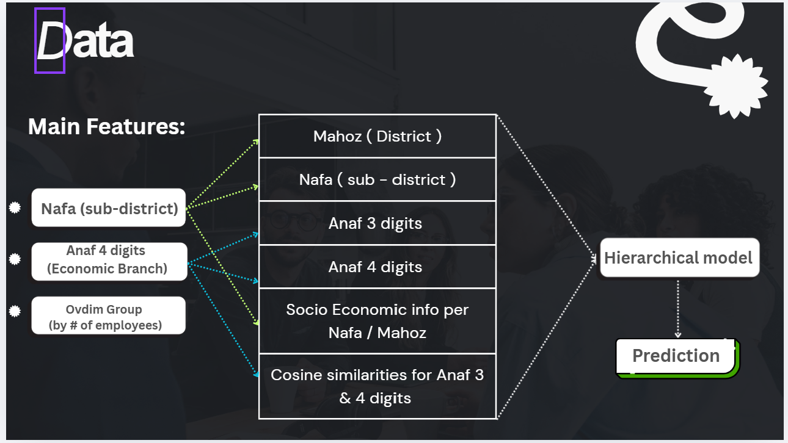
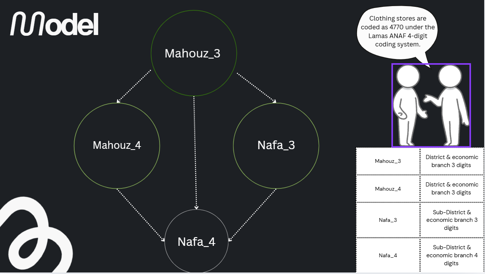

# CIDR Mean Income Prediction (Stacked / Hierarchical AutoGluon)

This repository contains work from my **CIDR Data Science internship**. The goal is to predict **regional mean income** using a stacked (multi-stage) modeling pipeline built with **AutoGluon Tabular**. We train models at different **sector × geography** granularities and **reuse model predictions as features** in later stages to improve the final model.

> **Note:** The original datasets are not included in this repository. The project is based on **aggregated LAMAS tax data**, enriched with **Israel Central Bureau of Statistics (CBS)** socio-economic information and additional engineered features.

---

## What’s inside
- **Notebook:** `cidr_mean_income_hierarchical_autogluon.ipynb`  
  End-to-end pipeline: preprocessing, staged training, evaluation, and final prediction generation.
- **Diagrams:** `cidr1.png`, `cidr2.png`

---

## Pipeline overview (stacked / hierarchical)
1. **Stage 1:** Train a model at the **3-digit sector + district** level and generate predictions.  
2. **Stage 2:** Use Stage 1 predictions as features to train two additional models:
   - **3-digit sector + district**
   - **4-digit sector + subdistrict**
3. **Final stage:** Train the final **4-digit sector + subdistrict** model using:
   - original features
   - Stage 1 predictions
   - Stage 2 prediction-features  
   Then generate the final predictions.

---

## Diagrams
### Data & Features


### Model structure


---

## Features used
- **Aggregated LAMAS tax data** (sector × geography aggregates)
- **CBS socio-economic features** at the district / subdistrict level
- **AI-based text features**:
  - sector-name **embeddings**
  - **cosine similarity** features derived from embeddings
- **Stacking features**: prediction outputs from earlier models merged back as inputs for later models

---

## Setup

### Requirements
- Python 3.9+ (recommended)
- `autogluon.tabular`
- `pandas`, `numpy`, `scikit-learn`

Example install:
```bash
pip install -U autogluon pandas numpy scikit-learn

